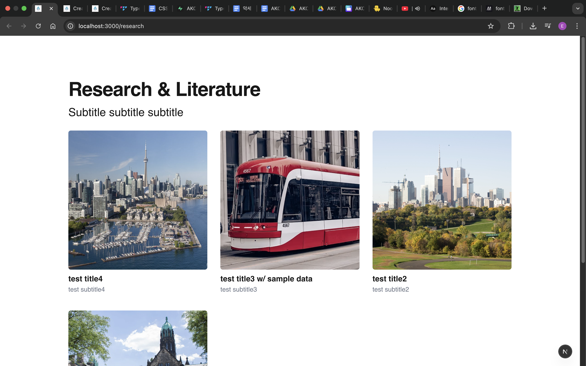
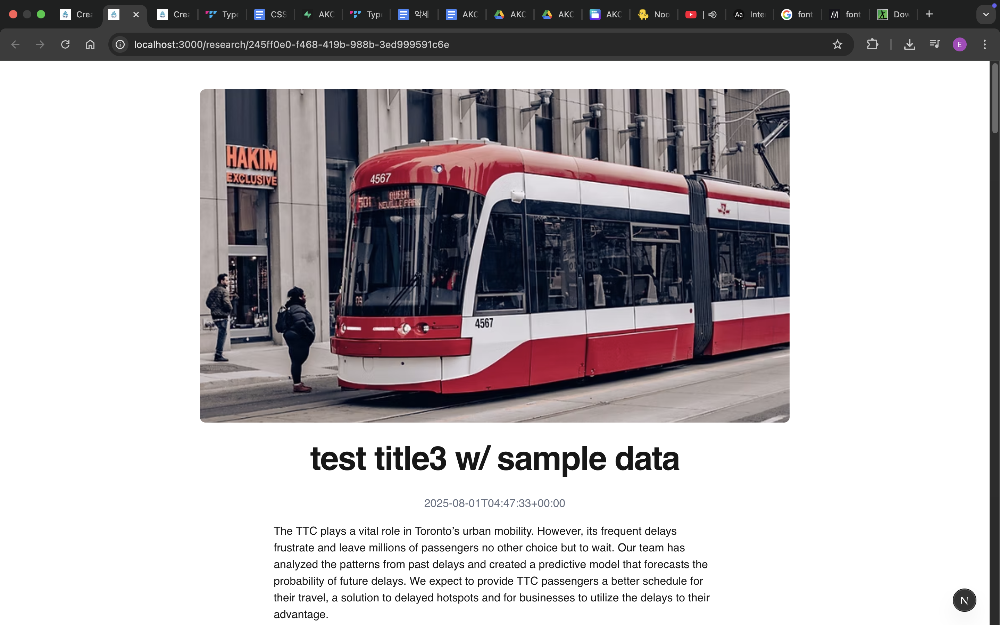
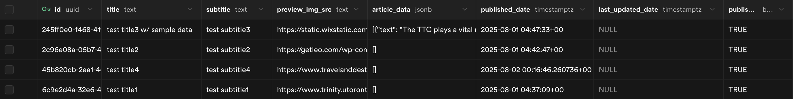
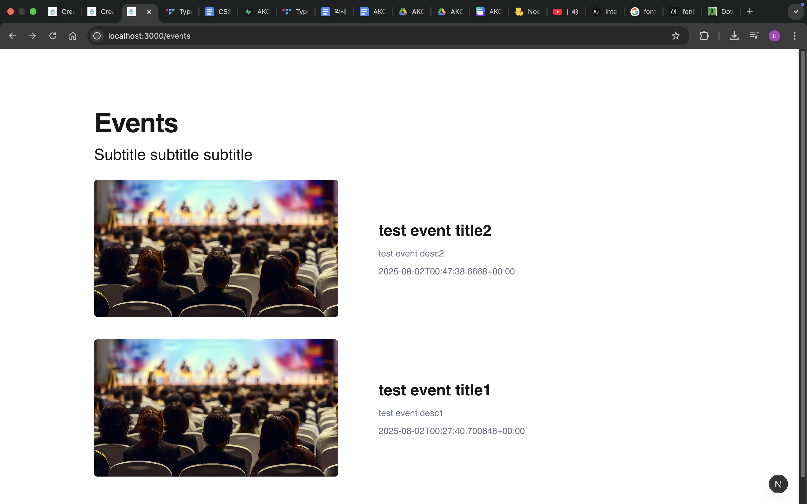
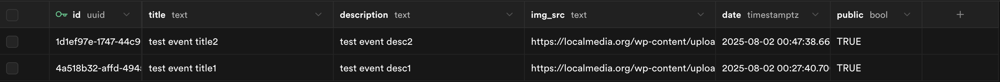
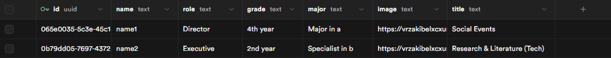
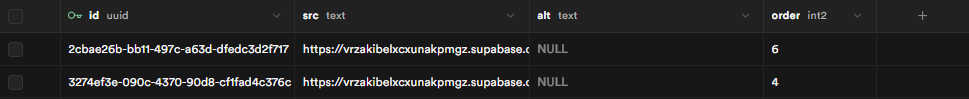

# AKCSE UofT Website

This repository contains the AKCSE UofT website built using Next.js, Tailwind CSS, and Supabase. Content for pages is dynamically rendered from the database, and upcoming events are fetched via the Google Calendar API. (https://akcseuoft.ca/)

## Note

- The project uses Supabase with a PostgreSQL database
- The data shown in the images below are sample data

## Research & Literature "/research"

<table style="width: 100%;">
  <tr>
    <td style="width: 50%;"></td>
    <td style="width: 50%;"></td>
  </tr>
</table>

Table: research
| Column | Description |
| ------------- | --------------------------- |
| `id` | [uuid] Randomly generated |
| `title` | [text] |
| `subtitle` | [text] |
| `preview_img_src` | [text] Thumbnail image seen as a card |
| `article_data` | [jsonb] The data contains component types: 1. `header` "type": "header", "header": {your header}  2. `text` "type": "text", "text": {your text} * Superscript can be done by typing `{superscripted text}` inside "text" 3. `text-bold` "type": "text-bold", "text": {your text} 4. `image` "type": "image", "image_src": {image url}, "image_description": {your description}  5. `video` "type": "video", "video_src": {video url}  6. `link` "type": "link", "link_title": {your title}, "link": {link url}   This structure enables the article to include multiple component types, allowing for easy modification and dynamic rendering by switching between components|
| `published_date` | [timestamptz] Initial published date of the article including the timezone (EDT by default) |
| `last_updated_date` | [timestamptz] Last modified date of the article including the timezone (EDT by default) |
| `published` | [bool] Used to control whether the visibility of the article is public or private |

## Events "/events"

<table style="width: 100%;">
  <tr>
    <td style="width: 50%;"></td>
  </tr>
</table>

Table: events
| Column | Description |
| ------------- | --------------------------- |
| `id` | [uuid] Randomly generated |
| `title` | [text] |
| `description` | [text] |
| `img_src` | [text] Thumbnail image seen as a card |
| `date` | [timestamptz] Date of the event including the timezone (EDT by default) |
| `public` | [bool] Used to control whether the visibility of the event is public or private |

## Members "/members"

<table style="width: 100%;">
  <tr>
    <td style="width: 50%;"></td>
  </tr>
</table>

Table:members
| Column | Description |
| ------------- | --------------------------- |
| `id` | [uuid] Randomly generated |
| `name` | [text] |
| `role` | [text] |
| `grade` | [text] |
| `major` | [text] |
| `image` | [text] Profile picture |
| `title` | [text] Department |

## Home "/"

<table style="width: 100%;">
  <tr>
    <td style="width: 50%;"></td>
  </tr>
</table>

Table: carousel
| Column | Description |
| ------------- | --------------------------- |
| `id` | [uuid] Randomly generated |
| `src` | [text] Image source |
| `alt` | [text] Image alt |
| `order` | [int2] Order of the image |